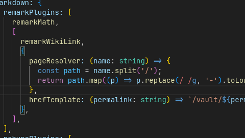

## Headings

# H1 — heading
## H2 — heading
### H3 — heading
#### H4 — heading
##### H5 - heading

## Paragraph

Quisque egestas convallis ipsum, ut sollicitudin risus tincidunt a. Maecenas interdum malesuada egestas. Duis consectetur porta risus, sit amet vulputate urna facilisis ac. Phasellus semper dui non purus ultrices sodales. Aliquam ante lorem, ornare a feugiat ac, finibus nec mauris. Vivamus ut tristique nisi. Sed vel leo vulputate, efficitur risus non, posuere mi. Nullam tincidunt bibendum rutrum. Proin commodo ornare sapien. Vivamus interdum diam sed sapien blandit, sit amet aliquam risus mattis. Nullam arcu turpis, mollis quis laoreet at, placerat id nibh. Suspendisse venenatis eros eros.

second line  
third line
4th line

New para
### Links 
Wikilink: 
- [[hello/World]]
- [[hello/World.md]]
- [[hello/World 2]]

Markdown link
- [World](hello/World)
- [world](hello/world)
- [World 2](hello/world%202)

Image:

![[img.png]]

Web: 
[google.com](https://google.com/)
 
https://www.google.com


## Lists

### Ordered list

1. Firstly
2. Secondly
3. Thirdly

### Unordered list

- Chapter
  - Section
    - Paragraph

### ToDo list

- [ ] Job
  - [x] Step 1
  - [x] Step 2
  - [ ] Step 3

### Description list

Sun
: the star around which the earth orbits

Moon
: the natural satellite of the earth, visible by reflected light from the sun

## Block Quote

> This line shows the _block quote_.

## Callout

> [!note] Note
> This is a note callout. Use it for general information.

> [!info] Information
> This is an info callout for important details.

> [!tip] Tip
> This is a tip callout for helpful suggestions.

> [!warning] Warning
> This is a warning callout. Be careful!

> [!danger] Danger
> This is a danger callout for critical warnings.

> [!success] Success
> This is a success callout for positive messages.

> [!important] 
> hi


## Tables

| Company                      | Contact          | Country |
| ---------------------------- | ---------------- | ------- |
| Alfreds Futterkiste          | Maria Anders     | Germany |
| Island Trading               | Helen Bennett    |      UK |
| Magazzini Alimentari Riuniti | Giovanni Rovelli |   Italy |

## Links

<http://127.0.0.1:4000>

## Footnote

Click the hook will locate the footnote[^footnote], and here is another footnote[^fn-nth-2].

## Inline code

This is an example of `Inline Code`.

## Filepath

Here is the `/path/to/the/file.extend`{: .filepath}.

## Code blocks

### Common

```text
This is a common code snippet, without syntax highlight and line number.
```

### Specific Language

```bash
if [ $? -ne 0 ]; then
  echo "The command was not successful.";
  #do the needful / exit
fi;
```

## Mathematics

The mathematics powered by [**MathJax**](https://www.mathjax.org/):

$$
\begin{equation}
  \sum_{n=1}^\infty 1/n^2 = \frac{\pi^2}{6}
  \label{eq:series}
\end{equation}
$$

We can reference the equation as \eqref{eq:series}.

When $a \ne 0$, there are two solutions to $ax^2 + bx + c = 0$ and they are

$$ x = {-b \pm \sqrt{b^2-4ac} \over 2a} $$


## Reverse Footnote

[^footnote]: The footnote source
[^fn-nth-2]: The 2nd footnote source